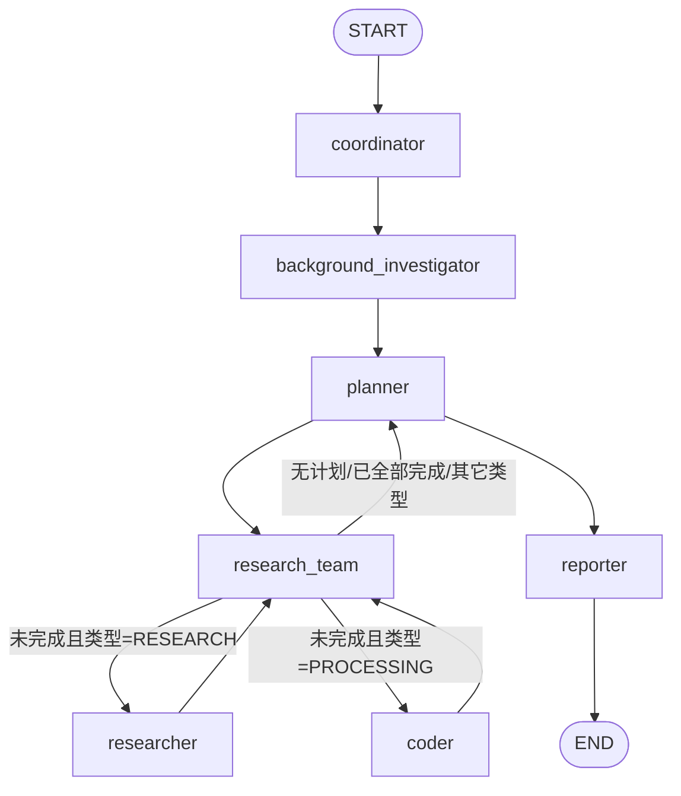
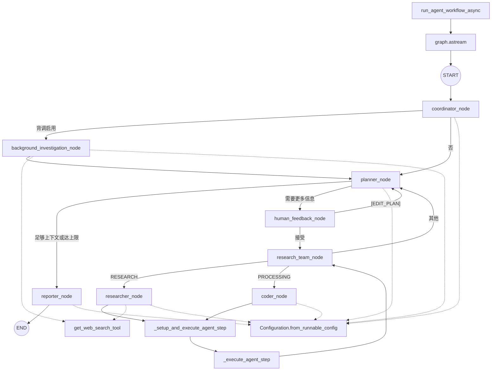

# FAQ

# 报错，和checkpoint无关, 获取的id方式从"id": event_data["__interrupt__"][0].ns[0] 改成"id": event_data["__interrupt__"][0].id, 可以考虑对langgraph降级
2025-09-02 13:01:55,500 - root - WARNING - Checkpoint saver is disabled, message not processed
ERROR:    Exception in ASGI application
  + Exception Group Traceback (most recent call last):
  |   File "/Users/admin/miniforge3/envs/multiagent/lib/python3.12/site-packages/starlette/_utils.py", line 76, in collapse_excgroups
  |     yield
  |   File "/Users/admin/miniforge3/envs/multiagent/lib/python3.12/site-packages/starlette/responses.py", line 263, in __call__
  |     async with anyio.create_task_group() as task_group:
  |                ^^^^^^^^^^^^^^^^^^^^^^^^^
  |   File "/Users/admin/miniforge3/envs/multiagent/lib/python3.12/site-packages/anyio/_backends/_asyncio.py", line 772, in __aexit__
  |     raise BaseExceptionGroup(
  | ExceptionGroup: unhandled errors in a TaskGroup (1 sub-exception)
  +-+---------------- 1 ----------------
    | Traceback (most recent call last):
    |   File "/Users/admin/miniforge3/envs/multiagent/lib/python3.12/site-packages/uvicorn/protocols/http/h11_impl.py", line 403, in run_asgi
    |     result = await app(  # type: ignore[func-returns-value]
    |              ^^^^^^^^^^^^^^^^^^^^^^^^^^^^^^^^^^^^^^^^^^^^^^
    |   File "/Users/admin/miniforge3/envs/multiagent/lib/python3.12/site-packages/uvicorn/middleware/proxy_headers.py", line 60, in __call__
    |     return await self.app(scope, receive, send)
    |            ^^^^^^^^^^^^^^^^^^^^^^^^^^^^^^^^^^^^
    |   File "/Users/admin/miniforge3/envs/multiagent/lib/python3.12/site-packages/fastapi/applications.py", line 1054, in __call__
    |     await super().__call__(scope, receive, send)
    |   File "/Users/admin/miniforge3/envs/multiagent/lib/python3.12/site-packages/starlette/applications.py", line 112, in __call__
    |     await self.middleware_stack(scope, receive, send)
    |   File "/Users/admin/miniforge3/envs/multiagent/lib/python3.12/site-packages/starlette/middleware/errors.py", line 187, in __call__
    |     raise exc
    |   File "/Users/admin/miniforge3/envs/multiagent/lib/python3.12/site-packages/starlette/middleware/errors.py", line 165, in __call__
    |     await self.app(scope, receive, _send)
    |   File "/Users/admin/miniforge3/envs/multiagent/lib/python3.12/site-packages/starlette/middleware/cors.py", line 93, in __call__
    |     await self.simple_response(scope, receive, send, request_headers=headers)
    |   File "/Users/admin/miniforge3/envs/multiagent/lib/python3.12/site-packages/starlette/middleware/cors.py", line 144, in simple_response
    |     await self.app(scope, receive, send)
    |   File "/Users/admin/miniforge3/envs/multiagent/lib/python3.12/site-packages/starlette/middleware/exceptions.py", line 62, in __call__
    |     await wrap_app_handling_exceptions(self.app, conn)(scope, receive, send)
    |   File "/Users/admin/miniforge3/envs/multiagent/lib/python3.12/site-packages/starlette/_exception_handler.py", line 53, in wrapped_app
    |     raise exc
    |   File "/Users/admin/miniforge3/envs/multiagent/lib/python3.12/site-packages/starlette/_exception_handler.py", line 42, in wrapped_app
    |     await app(scope, receive, sender)
    |   File "/Users/admin/miniforge3/envs/multiagent/lib/python3.12/site-packages/starlette/routing.py", line 714, in __call__
    |     await self.middleware_stack(scope, receive, send)
    |   File "/Users/admin/miniforge3/envs/multiagent/lib/python3.12/site-packages/starlette/routing.py", line 734, in app
    |     await route.handle(scope, receive, send)
    |   File "/Users/admin/miniforge3/envs/multiagent/lib/python3.12/site-packages/starlette/routing.py", line 288, in handle
    |     await self.app(scope, receive, send)
    |   File "/Users/admin/miniforge3/envs/multiagent/lib/python3.12/site-packages/starlette/routing.py", line 76, in app
    |     await wrap_app_handling_exceptions(app, request)(scope, receive, send)
    |   File "/Users/admin/miniforge3/envs/multiagent/lib/python3.12/site-packages/starlette/_exception_handler.py", line 53, in wrapped_app
    |     raise exc
    |   File "/Users/admin/miniforge3/envs/multiagent/lib/python3.12/site-packages/starlette/_exception_handler.py", line 42, in wrapped_app
    |     await app(scope, receive, sender)
    |   File "/Users/admin/miniforge3/envs/multiagent/lib/python3.12/site-packages/starlette/routing.py", line 74, in app
    |     await response(scope, receive, send)
    |   File "/Users/admin/miniforge3/envs/multiagent/lib/python3.12/site-packages/starlette/responses.py", line 262, in __call__
    |     with collapse_excgroups():
    |          ^^^^^^^^^^^^^^^^^^^^
    |   File "/Users/admin/miniforge3/envs/multiagent/lib/python3.12/contextlib.py", line 158, in __exit__
    |     self.gen.throw(value)
    |   File "/Users/admin/miniforge3/envs/multiagent/lib/python3.12/site-packages/starlette/_utils.py", line 82, in collapse_excgroups
    |     raise exc
    |   File "/Users/admin/miniforge3/envs/multiagent/lib/python3.12/site-packages/starlette/responses.py", line 266, in wrap
    |     await func()
    |   File "/Users/admin/miniforge3/envs/multiagent/lib/python3.12/site-packages/starlette/responses.py", line 246, in stream_response
    |     async for chunk in self.body_iterator:
    |   File "/Users/admin/git/deer-flow/src/server/app.py", line 349, in _astream_workflow_generator
    |     async for event in _stream_graph_events(
    |   File "/Users/admin/git/deer-flow/src/server/app.py", line 250, in _stream_graph_events
    |     yield _create_interrupt_event(thread_id, event_data)
    |           ^^^^^^^^^^^^^^^^^^^^^^^^^^^^^^^^^^^^^^^^^^^^^^
    |   File "/Users/admin/git/deer-flow/src/server/app.py", line 177, in _create_interrupt_event
    |     "id": event_data["__interrupt__"][0].ns[0],
    |           ^^^^^^^^^^^^^^^^^^^^^^^^^^^^^^^^^
    | AttributeError: 'Interrupt' object has no attribute 'ns'
    +------------------------------------
During handling of the above exception, another exception occurred:
Traceback (most recent call last):
  File "/Users/admin/miniforge3/envs/multiagent/lib/python3.12/site-packages/uvicorn/protocols/http/h11_impl.py", line 403, in run_asgi
    result = await app(  # type: ignore[func-returns-value]
             ^^^^^^^^^^^^^^^^^^^^^^^^^^^^^^^^^^^^^^^^^^^^^^
  File "/Users/admin/miniforge3/envs/multiagent/lib/python3.12/site-packages/uvicorn/middleware/proxy_headers.py", line 60, in __call__
    return await self.app(scope, receive, send)
           ^^^^^^^^^^^^^^^^^^^^^^^^^^^^^^^^^^^^
  File "/Users/admin/miniforge3/envs/multiagent/lib/python3.12/site-packages/fastapi/applications.py", line 1054, in __call__
    await super().__call__(scope, receive, send)
  File "/Users/admin/miniforge3/envs/multiagent/lib/python3.12/site-packages/starlette/applications.py", line 112, in __call__
    await self.middleware_stack(scope, receive, send)
  File "/Users/admin/miniforge3/envs/multiagent/lib/python3.12/site-packages/starlette/middleware/errors.py", line 187, in __call__
    raise exc
  File "/Users/admin/miniforge3/envs/multiagent/lib/python3.12/site-packages/starlette/middleware/errors.py", line 165, in __call__
    await self.app(scope, receive, _send)
  File "/Users/admin/miniforge3/envs/multiagent/lib/python3.12/site-packages/starlette/middleware/cors.py", line 93, in __call__
    await self.simple_response(scope, receive, send, request_headers=headers)
  File "/Users/admin/miniforge3/envs/multiagent/lib/python3.12/site-packages/starlette/middleware/cors.py", line 144, in simple_response
    await self.app(scope, receive, send)
  File "/Users/admin/miniforge3/envs/multiagent/lib/python3.12/site-packages/starlette/middleware/exceptions.py", line 62, in __call__
    await wrap_app_handling_exceptions(self.app, conn)(scope, receive, send)
  File "/Users/admin/miniforge3/envs/multiagent/lib/python3.12/site-packages/starlette/_exception_handler.py", line 53, in wrapped_app
    raise exc
  File "/Users/admin/miniforge3/envs/multiagent/lib/python3.12/site-packages/starlette/_exception_handler.py", line 42, in wrapped_app
    await app(scope, receive, sender)
  File "/Users/admin/miniforge3/envs/multiagent/lib/python3.12/site-packages/starlette/routing.py", line 714, in __call__
    await self.middleware_stack(scope, receive, send)
  File "/Users/admin/miniforge3/envs/multiagent/lib/python3.12/site-packages/starlette/routing.py", line 734, in app
    await route.handle(scope, receive, send)
  File "/Users/admin/miniforge3/envs/multiagent/lib/python3.12/site-packages/starlette/routing.py", line 288, in handle
    await self.app(scope, receive, send)
  File "/Users/admin/miniforge3/envs/multiagent/lib/python3.12/site-packages/starlette/routing.py", line 76, in app
    await wrap_app_handling_exceptions(app, request)(scope, receive, send)
  File "/Users/admin/miniforge3/envs/multiagent/lib/python3.12/site-packages/starlette/_exception_handler.py", line 53, in wrapped_app
    raise exc
  File "/Users/admin/miniforge3/envs/multiagent/lib/python3.12/site-packages/starlette/_exception_handler.py", line 42, in wrapped_app
    await app(scope, receive, sender)
  File "/Users/admin/miniforge3/envs/multiagent/lib/python3.12/site-packages/starlette/routing.py", line 74, in app
    await response(scope, receive, send)
  File "/Users/admin/miniforge3/envs/multiagent/lib/python3.12/site-packages/starlette/responses.py", line 262, in __call__
    with collapse_excgroups():
         ^^^^^^^^^^^^^^^^^^^^
  File "/Users/admin/miniforge3/envs/multiagent/lib/python3.12/contextlib.py", line 158, in __exit__
    self.gen.throw(value)
  File "/Users/admin/miniforge3/envs/multiagent/lib/python3.12/site-packages/starlette/_utils.py", line 82, in collapse_excgroups
    raise exc
  File "/Users/admin/miniforge3/envs/multiagent/lib/python3.12/site-packages/starlette/responses.py", line 266, in wrap
    await func()
  File "/Users/admin/miniforge3/envs/multiagent/lib/python3.12/site-packages/starlette/responses.py", line 246, in stream_response
    async for chunk in self.body_iterator:
  File "/Users/admin/git/deer-flow/src/server/app.py", line 349, in _astream_workflow_generator
    async for event in _stream_graph_events(
  File "/Users/admin/git/deer-flow/src/server/app.py", line 250, in _stream_graph_events
    yield _create_interrupt_event(thread_id, event_data)
          ^^^^^^^^^^^^^^^^^^^^^^^^^^^^^^^^^^^^^^^^^^^^^^
  File "/Users/admin/git/deer-flow/src/server/app.py", line 177, in _create_interrupt_event
    "id": event_data["__interrupt__"][0].ns[0],
          ^^^^^^^^^^^^^^^^^^^^^^^^^^^^^^^^^
AttributeError: 'Interrupt' object has no attribute 'ns'

# Node的节点工作流

# src/server/app.py讲解，fastapi的url
重点接口：POST /api/chat/stream（流式聊天）

这个接口返回 SSE（text/event-stream），把工作流运行过程中的消息/工具调用逐条往前端推。

入口与参数

请求体模型：ChatRequest

含 messages（聊天历史）、thread_id、resources、max_* 限制、auto_accepted_plan、interrupt_feedback、report_style、enable_deep_thinking 等。

thread_id == "__default__" 时，会改成一个新的 uuid4()，避免所有会话都写到同一个线程。

POST /api/tts：火山引擎 TTS

从环境变量取 VOLCENGINE_TTS_APPID/ACCESS_TOKEN 等；

调 VolcengineTTS.text_to_speech(...)；

返回 audio/{encoding} 二进制（Content-Disposition: attachment）。

POST /api/podcast/generate：播客音频

用 build_podcast_graph() 调工作流；final_state["output"] 是字节流，返回 audio/mp3。

POST /api/ppt/generate：PPT 生成

build_ppt_graph()，拿到 generated_file_path，读文件字节，返回 application/vnd.openxmlformats-officedocument.presentationml.presentation。

POST /api/prose/generate：散文/文案流式生成

build_prose_graph().astream(..., stream_mode="messages", subgraphs=True)；

直接把 event[0].content 打到 SSE：data: <content>\n\n。
-（提示：这里没有区分工具事件/中断，只按消息内容直推，足够简单。）

POST /api/prompt/enhance：Prompt 增强

request.report_style 映射到 ReportStyle（大小写不敏感，异常默认 ACADEMIC）；

build_prompt_enhancer_graph().invoke(...) 返回 JSON：{"result": ...}。

POST /api/mcp/server/metadata：MCP 工具元数据

受 ENABLE_MCP_SERVER_CONFIGURATION 保护，未开→403；

可设置超时（默认 300s）；

load_mcp_tools(...) 拉取并回传工具列表。

GET /api/rag/config：返回 RAG 提供商（SELECTED_RAG_PROVIDER）。

GET /api/rag/resources：列出 RAG 资源（通过 build_retriever()）。

GET /api/config：返回 RAG 配置 + 可用模型列表（get_configured_llm_models()）。

# 执行流程

* 入口：`run_agent_workflow_async` 用 `graph.astream(...)` 驱动 LangGraph；图的结构来自 `builder._build_base_graph()`。
* 协调器 `coordinator_node` 触发 `handoff_to_planner` 后，根据 `enable_background_investigation` 决定先到 `background_investigation_node` 还是直接到 `planner_node`；否则流程可能终止。
* 计划阶段 `planner_node → human_feedback_node → research_team_node` 循环，`research_team_node` 依据 `continue_to_running_research_team` 分发到 `researcher_node` / `coder_node` / `planner_node`。
* `researcher_node` / `coder_node` 均经由 `_setup_and_execute_agent_step` 统一装配（可接入 MCP 工具），最终都调用 `_execute_agent_step`，执行后回到 `research_team_node`。
* 搜索工具：`background_investigation_node` 与 `researcher_node` 都会用到 `get_web_search_tool()`（实际返回哪种工具取决于 `SELECTED_SEARCH_ENGINE`）。
* 多个节点都会读取 `Configuration.from_runnable_config(config)` 获取运行时参数（图中用虚线标注）。
