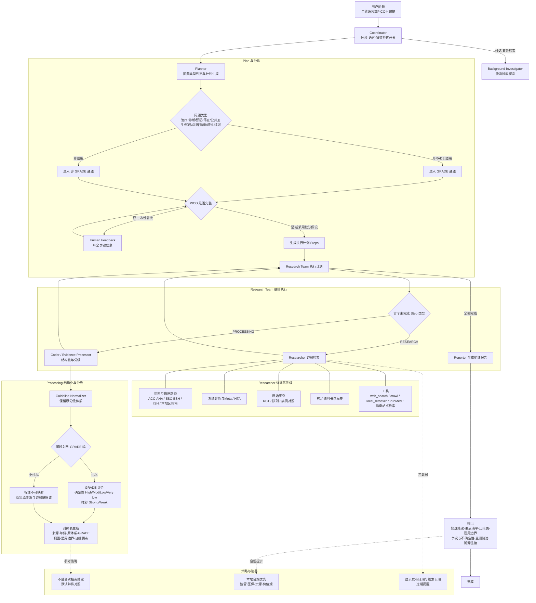

# 流程
Triage 分诊器（共用 coordinator）：识别问题类型（治疗/诊断/预后/病因/指南/药物/综述），并判定是否进入 GRADE 适用通道（诊断、筛查、预防、治疗、公共卫生问题）。若不适用，走“非 GRADE 通道”（照样严格溯源、标注研究设计与偏倚）。

PICO Elicitor（由 planner 驱动 + human_feedback 回路兜底）：抽取/补全 PICO；PICO 不全则向用户一次性追问缺口（不阻塞则用可推断的默认假设并标注不确定性降低证据确定性）。

Evidence Retriever（沿用 researcher，强化工具）：优先指南/系统评价/临床路径，必要时原始研究。支持 PubMed/指南官网/学会站点检索与抓取。

Guideline Normalizer（由 coder 承担“PROCESSING”步）：将不同来源（ACC/AHA、ESH、ISH、中华医学会等）的推荐分级体系映射到统一展示层（含原体系与映射后的 GRADE 视图并排显示，保持不合并、不混编）。

GRADE Assessor（PROCESSING 步）：基于 Core GRADE/Handbook 规则，对适配问题给出证据确定性与推荐强度；若来源非 GRADE，走“映射 / 不可映射标注”策略（见下）。

Recommendation Synthesizer（沿用 reporter，改模板）：输出“快速结论 + 分栏表 + 推荐分级 + 适用人群/边界 + 争议/不确定性 + 溯源链接”。

# 绘图
